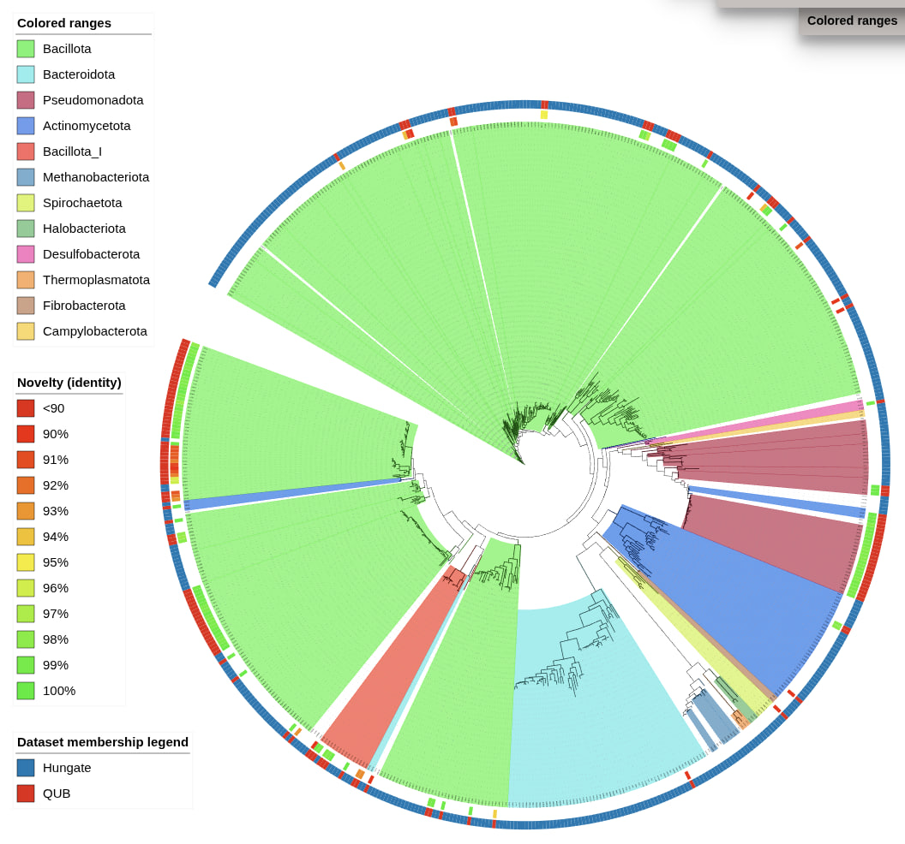

# PhyloSelect -  WARNING - BETA! - This tool is in early development. Expect bugs, breaking changes, and rough edges. Please report issues and contribute improvements!

**Marker-gene QC, taxonomy, novelty scoring, and isolate prioritisation for genome-sequencing candidate selection.**

PhyloSelect helps answer the question:

> Has this lineage already been seen and characterised, or is it still poorly represented enough to justify deeper follow-up such as whole-genome sequencing?

It combines Sanger/AB1 quality control, marker-gene taxonomic classification, nearest-neighbour novelty scoring, neighbourhood density (crowding), Most Wanted List matching, and phylogenetic tree visualisation into sequence assessment and selection reports.



---

## Quick start

```bash
# 1. Load a baseline dataset and build a reference tree
phyloselect preload \
  --fasta hungate.fasta \
  --db project.db \
  --dataset Hungate \
  --ref gtdb_r232_bac_arch_ssu_reps.fna \
  --classify --build-tree \
  -o preload_out \
  --threads 10

# 2. Process new sequences — scores novelty against the baseline
phyloselect run \
  --input new_sequences.fasta \
  --db project.db \
  --dataset Batch1 \
  --ref gtdb_r232_bac_arch_ssu_reps.fna \
  --preload-dir preload_out \
  -o batch1_out \
  --threads 10

# 3. Zoom into a specific taxon
phyloselect subtree \
  --db project.db \
  --taxon archaea \
  --from-dir preload_out \
  -o archaea_out

# 4. Regenerate iTOL files with new grouping options
phyloselect regen-itol \
  --db project.db \
  --out preload_out \
  --group-phyla archaea \
  --group-phyla "Bacillota,Bacillota_I,Bacillota_A"
```

---

## Core concepts

### Novelty is relative to YOUR submitted sequences

All novelty and neighbourhood-density calculations are made against the sequences submitted to PhyloSelect (the preload database plus all prior `run` datasets stored in the DB). They are **not** made against the full external reference (GTDB/SILVA) unless no user-submitted sequences are present.

This is intentional: PhyloSelect helps you judge whether a new sequence is worth investigating relative to what your lab or project has already characterised — not relative to all known biology.

Each successive `run` extends the reference pool, so novelty scores become increasingly precise as your project grows.

### Three-layer tree architecture

The phylogenetic tree is built from three independent layers:

| Layer | Source | Shown in iTOL? |
|---|---|---|
| 1 — Anchors | 26 NCBI RefSeq anchor sequences (bundled) | **No** — invisible topology scaffolding |
| 2 — Preload | Your baseline dataset (e.g. Hungate) | Yes |
| 3 — Run sequences | Each new `phyloselect run` batch | Yes |

Anchor sequences constrain phylum-level topology during MAFFT + FastTree inference, then are pruned from the stored newick. They are never shown in outputs, iTOL files, or novelty scoring.

---

## Subcommands

### `phyloselect preload`

Load a baseline FASTA dataset, classify against a reference, and build the backbone tree. This is always the first step.

```bash
phyloselect preload \
  --fasta baseline.fasta \
  --db project.db \
  --dataset Hungate \
  --ref gtdb_r232_bac_arch_ssu_reps.fna \
  --classify --build-tree \
  -o preload_out \
  --threads 10 \
  --collapse
```

| Parameter | Required | Default | Description |
|---|---|---|---|
| `--fasta` | ✓ | — | Input FASTA file containing the baseline sequences |
| `--db` | ✓ | — | Path to the PhyloSelect SQLite database (created if absent) |
| `-o / --out` | | `.` | Output directory for tree, iTOL files, and reports |
| `--dataset` | ✓ | — | Label stored in the DB (e.g. `Hungate`) |
| `--ref` | | — | Reference FASTA (GTDB/SILVA reps) for classification and tree orientation |
| `--classify` | | off | Classify sequences against `--ref` and store taxonomy |
| `--build-tree` | | off | Build the MAFFT + FastTree backbone tree |
| `--taxa` | | — | TSV mapping reference IDs to lineages (optional when `--ref` headers contain GTDB lineages) |
| `--taxa-assignments` | | — | Pre-computed taxonomy for the INPUT sequences (TSV or embedded-lineage FASTA) |
| `--shorten-ids / --no-shorten-ids` | | `--no-shorten-ids` | Preserve input headers exactly by default; use `--shorten-ids` only when compact generated IDs are desired |
| `--collapse` | | off | Collapse near-identical same-taxonomy sequences into one representative for the tree |
| `--collapse-threshold` | | `99.8` | Identity threshold (%) for collapsing |
| `--sequence-domain` | | `bacteria` | Domain/profile to process: `bacteria`, `archaea`, `fungi`, or `mixed`/`all`/`none` to disable filtering. Use matching references, preloads, and anchors for non-bacterial runs |
| `--kingdom` | | — | Backward-compatible explicit domain/kingdom filter; overrides `--sequence-domain` |
| `--anchors` | | bundled | Custom anchor FASTA for tree topology scaffolding |
| `--threads` | | `4` | CPU threads for MAFFT and VSEARCH |
| `--colors` | | — | CSV mapping sequence IDs to custom hex colours for iTOL (columns: `id`, `color`) |
| `--group-phyla SPEC` | | — | Group phyla into a single colour in iTOL (repeatable; see *Phylum grouping*) |
| `--functional` | | — | TSV file mapping sequence IDs to functional attributes (first column = ID; subsequent columns = attributes). Generates one iTOL file per column (DATASET_BINARY / DATASET_SIMPLEBAR / DATASET_COLORSTRIP). |

---

### `phyloselect sanger` / `phyloselect ab1`

Convert Sanger AB1 chromatograms or already-basecalled primer reads into a trimmed FASTA for `evaluate`. When multiple reads belong to the same isolate, for example `27F` and `907R`, PhyloSelect orients reverse-primer reads and builds a quality-aware overlap consensus.

```bash
phyloselect sanger \
  --input sanger_reads/ \
  -o sanger_out \
  --min-quality 20 \
  --min-mean-quality 25 \
  --min-length 800 \
  --min-overlap 40

phyloselect evaluate \
  --input sanger_out/assembled.fasta \
  --partner-metadata new_sequences_metadata.tsv \
  --db project.db \
  --dataset Batch1 \
  --ref gtdb_r232_bac_arch_ssu_reps.fna \
  -o batch1_out
```

If filenames are structured like `Iso001_27F.ab1` and `Iso001_907R.ab1`, PhyloSelect infers `Iso001` as the sequence ID, keeps `27F` forward, and reverse-complements `907R` before assembly. If filenames are not informative, provide `--read-metadata` as CSV/TSV:

```tsv
file	sequence_id	primer	direction
well_A01.ab1	Iso001	27F	forward
well_A02.ab1	Iso001	907R	reverse
```

For partner submissions, a simpler one-row-per-isolate sample map can be used instead. Relative paths are resolved from the mapping file location, so this can be kept next to the chromatograms. Add `processing_mode` (or `mode`, `assembly_mode`, `tags`, or `flags`) when a specific isolate should use a different handling strategy:

```tsv
isolate_id	27F	907R	processing_mode
Iso001	well_A01.ab1	well_A02.ab1	assemble
Iso002	well_B01.ab1	well_B02.ab1	best_read
```

or:

```tsv
isolate_id	ab1_files	tags
Iso001	well_A01.ab1;well_A02.ab1	assemble
Iso002	well_B01.ab1;well_B02.ab1	highest_quality
```

Run it with:

```bash
phyloselect sanger --sample-map sample_reads.tsv -o sanger_out
```

`assemble`/`merge`/`consensus` orients the primer reads and tries to build one longer sequence. `best_read`/`highest_quality`/`select_best`/`independent` converts each read independently and writes only the highest-quality passing read for that isolate.

PhyloSelect treats Sanger QC conservatively:

- `--min-quality` is a Phred cutoff used for Mott-style end trimming.
- `--mask-quality` masks internal bases below the Phred cutoff to `N` before assembly.
- `--min-mean-quality`, expected-error limits, `--max-n-percent`, and overlap conflict density determine `PASS_HIGH_CONFIDENCE`, `PASS_WITH_WARNINGS`, or `FAIL_QC`.
- Final `FAIL_QC` sequences are withheld from `assembled.fasta` and listed as `RESEQUENCE`.
- `PASS_WITH_WARNINGS` sequences are included but listed as `MANUAL_REVIEW`.

By default, reads and final outputs must be at least 800 bp. If shorter reads should be allowed into a multi-primer assembly while the final consensus still has to be 800 bp, use `--min-read-length`, for example `--min-read-length 100 --min-length 800`.

Outputs:

| File | Description |
|---|---|
| `assembled.fasta` | One trimmed/assembled sequence per isolate, suitable for `phyloselect evaluate --input` |
| `trimmed_oriented_reads.fasta` | Individual reads after quality trimming and primer-direction orientation |
| `raw_reads.fasta` | Raw base calls extracted from AB1 or input sequence files |
| `read_qc.tsv` | Per-read trimming, quality, expected error, length, and filter status |
| `per_base_error.tsv` | Per-base quality/error probability table with left/right trim and retained-base status |
| `read_error_profiles.svg` | Visual per-read quality/error profile showing the retained trim window |
| `assembly_report.tsv` | Per-isolate assembly status, overlap identity, conflicts, unmerged reads, and contributing read IDs |
| `resequence_recommendations.tsv` | Per-isolate `ACCEPT`, `MANUAL_REVIEW`, or `RESEQUENCE` decision with reason codes and suggested action |
| `sanger_qc_policy.tsv` | Thresholds used for the run, for reproducibility |
| `assembly_overview.svg` | Visual per-isolate assembly overview showing consensus/read lengths and assembly diagnostics |
| `sanger_summary.txt` | Short run summary |

Supported inputs are `.ab1`, `.abi`, `.fasta`, `.fa`, `.fna`, `.fastq`, and `.fq`, with `.gz` accepted for AB1/ABI, FASTA, and FASTQ files.

---

### `phyloselect run` / `phyloselect evaluate`

Process new sequences against the baseline; score novelty and update the phylogenetic tree.

```bash
phyloselect run \
  --input new_sequences.fasta \
  --db project.db \
  --dataset Batch1 \
  --ref gtdb_r232_bac_arch_ssu_reps.fna \
  --preload-dir preload_out \
  -o batch1_out \
  --threads 10 \
  --collapse
```

| Parameter | Required | Default | Description |
|---|---|---|---|
| `--input` | ✓ | — | FASTA file of new sequences to analyse |
| `--db` | ✓ | — | Path to the PhyloSelect SQLite database |
| `-o / --out` | ✓ | — | Output directory (assessment TSV, novelty metrics, tree, iTOL files) |
| `--dataset` | ✓ | — | Label for this batch (used in iTOL dataset-membership strip) |
| `--ref` | | — | Reference FASTA for classification and tree orientation |
| `--preload-dir` | | — | Path to the preload output directory — enables fast incremental tree updates |
| `--taxa` | | — | TSV mapping reference IDs to lineages |
| `--taxa-assignments` | | — | Pre-computed taxonomy for the input sequences |
| `--partner-metadata / --sequencing-metadata` | evaluate | — | CSV/TSV sidecar table with sequence IDs, partner IDs, and selected-for-genome-sequencing status |
| `--shorten-ids / --no-shorten-ids` | | `--no-shorten-ids` | Preserve input headers exactly by default; use `--shorten-ids` only when compact generated IDs are desired |
| `--min-len` | | `1200` | Minimum sequence length to retain (bp) |
| `--max-n` | | `5` | Maximum ambiguous (N) bases allowed |
| `--collapse` | | off | Collapse near-identical same-taxonomy sequences for the tree |
| `--collapse-threshold` | | `99.8` | Identity threshold (%) for collapsing |
| `--sequence-domain` | | `bacteria` | Domain/profile to process: `bacteria`, `archaea`, `fungi`, or `mixed`/`all`/`none` to disable filtering. Run archaea/fungi separately with matching `--ref`, `--alt-ref`, `--baseline-fasta`, `--preload-dir`, and `--anchors` |
| `--kingdom` | | — | Backward-compatible explicit domain/kingdom filter; overrides `--sequence-domain` |
| `--phylum` | | — | Filter iTOL output to a specific phylum (does not affect novelty scoring) |
| `--target` | | — | FASTA to measure novelty against instead of the DB |
| `--baseline-fasta` | | — | Baseline/context FASTA to load before evaluating, e.g. Hungate |
| `--baseline-dataset` | | `Baseline` | Dataset label for `--baseline-fasta` and default cultured-baseline novelty pool |
| `--novelty-baseline-dataset` | | — | Existing DB dataset to include in the baseline novelty pool; repeatable |
| `--baseline-shorten-ids / --no-baseline-shorten-ids` | | `--no-baseline-shorten-ids` | Preserve baseline IDs exactly by default |
| `--force-rebuild` | | off | Force a full tree rebuild from scratch |
| `--anchors` | | bundled | Custom anchor FASTA for tree scaffolding |
| `--threads` | | `4` | CPU threads |
| `--user-colors` | | — | CSV mapping sequence IDs to custom hex colours for iTOL |
| `--group-phyla SPEC` | | — | Group phyla into a single colour in iTOL (repeatable) |
| `--functional` | | — | TSV file mapping sequence IDs to functional attributes (first column = ID; subsequent columns = attributes). Generates one iTOL file per column (DATASET_BINARY / DATASET_SIMPLEBAR / DATASET_COLORSTRIP). |

Domain/profile handling:

PhyloSelect defaults to `--sequence-domain bacteria` for `preload` and `evaluate`. This keeps bacterial 16S runs clean by filtering non-bacterial assignments before DB insertion and tree building where taxonomy is available. Process archaea and fungi as separate runs with their own DB/output/preload/reference setup:

```bash
phyloselect evaluate ... --sequence-domain archaea --ref archaeal_16s_refs.fasta --preload-dir archaea_preload -o archaea_eval
phyloselect evaluate ... --sequence-domain fungi --ref fungal_its_or_18s_refs.fasta --anchors fungal_anchors.fasta -o fungi_eval
```

Use `--sequence-domain mixed` when you intentionally want to keep all domains in one run. The older `--kingdom` flag still works and overrides `--sequence-domain`.

---

### `phyloselect subtree`

Extract all sequences matching a given taxon from the DB and build a focused phylogenetic tree for that group only.

**Fast path** (recommended): if `--from-dir` points to a directory containing `current_alignment.fasta`, sequences are sliced from the pre-built MSA and only FastTree is run — seconds to minutes for any sized group.

**Slow path**: if no existing alignment is found, a full MAFFT + FastTree build is performed.

```bash
# Domain-level (auto-detected keyword)
phyloselect subtree --db project.db --taxon archaea      --from-dir preload_out -o archaea_out
phyloselect subtree --db project.db --taxon bacteria     --from-dir preload_out -o bacteria_out

# Phylum — plain name (rank auto-detected) or GTDB-prefixed
phyloselect subtree --db project.db --taxon Bacteroidota       --from-dir preload_out -o bact_out
phyloselect subtree --db project.db --taxon p__Bacillota       --from-dir preload_out -o firm_out

# Family
phyloselect subtree --db project.db --taxon f__Lachnospiraceae --from-dir preload_out -o lachno_out

# Genus
phyloselect subtree --db project.db --taxon g__Ruminococcus    --from-dir preload_out -o rumino_out
```

Accepted taxon formats:

| Input | Detected rank | Notes |
|---|---|---|
| `archaea` / `bacteria` | domain | Auto-matched case-insensitively |
| `Bacillota` | phylum (fallback) | No prefix → defaults to phylum |
| `p__Bacillota` | phylum | GTDB prefix auto-detected |
| `f__Lachnospiraceae` | family | |
| `g__Ruminococcus` | genus | |
| `d__Archaea` | domain | Explicit GTDB domain prefix |

| Parameter | Required | Default | Description |
|---|---|---|---|
| `--db` | ✓ | — | Path to the PhyloSelect SQLite database |
| `-o / --out` | ✓ | — | Output directory |
| `--taxon` | ✓ | — | Taxon to extract (see table above) |
| `--rank` | | `auto` | Override rank detection: `domain` / `phylum` / `family` / `genus` / `species` |
| `--from-dir` | | — | Existing preload/run output dir with `current_alignment.fasta` or `tree/current_alignment.fasta` (fast path) |
| `--ref` | | — | Reference FASTA for orientation correction (slow path only) |
| `--anchors` | | bundled | Custom anchor FASTA |
| `--threads` | | `4` | CPU threads |
| `--min-seqs` | | `3` | Minimum matching sequences required to build a tree |
| `--no-tree` | | off | Skip tree building; only write taxonomy TSV and iTOL colour files |
| `--group-phyla SPEC` | | — | Group phyla into a single colour in iTOL (repeatable) |
| `--functional` | | — | TSV file mapping sequence IDs to functional attributes (first column = ID; subsequent columns = attributes). Generates one iTOL file per column (DATASET_BINARY / DATASET_SIMPLEBAR / DATASET_COLORSTRIP). |

Subtree outputs:

| File | Contents |
|---|---|
| `subtree_tree.nwk` | Focused newick tree (anchor-free, nodes labelled `NODE####`) |
| `subtree_alignment.fasta` | Filtered alignment slice used for the tree |
| `subtree_combined_taxonomy.tsv` | ID → taxonomy → confidence for matched sequences |
| `subtree_sequence_list.tsv` | ID, taxonomy, confidence, dataset for matched sequences |
| `itol_phylum_colors.itol` | iTOL colour strip by phylum |
| `itol_dataset_membership.itol` | iTOL strip showing which dataset each sequence came from |

---

### `phyloselect regen-itol`

Regenerate all iTOL colour files from taxonomy already stored in the DB — without re-classifying or rebuilding the tree. Useful when changing phylum groupings.

```bash
phyloselect regen-itol \
  --db project.db \
  --out preload_out \
  --group-phyla archaea \
  --group-phyla "Bacillota,Bacillota_I,Bacillota_A"
```

| Parameter | Required | Default | Description |
|---|---|---|---|
| `--db` | ✓ | — | Path to the PhyloSelect SQLite database |
| `-o / --out` | ✓ | — | Output directory (use your preload or run output dir) |
| `--include-datasets` | | all | Comma-separated dataset names to include |
| `--kingdom` | | — | Include only sequences from this domain |
| `--group-phyla SPEC` | | — | Group phyla into a single colour (repeatable) |
| `--functional` | | — | TSV file mapping sequence IDs to functional attributes (first column = ID; subsequent columns = attributes). Generates one iTOL file per column (DATASET_BINARY / DATASET_SIMPLEBAR / DATASET_COLORSTRIP). |

---

## Phylum grouping for iTOL (`--group-phyla`)

Available on all four subcommands. Groups multiple phyla into a single colour entry in the iTOL legend.

| Spec format | Effect |
|---|---|
| `archaea` | All archaeal phyla (detected by `d__Archaea` domain) → one colour labelled **Archaea** |
| `bacteria` | All bacterial phyla → one colour labelled **Bacteria** |
| `"Bacillota,Bacillota_I,Bacillota_A"` | These three phyla → one colour; label = first name (`Bacillota`) |
| `"Firmicutes:Bacillota,Bacillota_I"` | These two phyla → one colour labelled **Firmicutes** |

Multiple `--group-phyla` arguments are independent and additive:

```bash
phyloselect run ... \
  --group-phyla archaea \
  --group-phyla "Bacillota,Bacillota_I,Bacillota_A" \
  --group-phyla "Bacteroidota,Bacteroidota_A"
```

---

## Multiple dataset stacking

Datasets accumulate in the DB. Each `run` sees the growing baseline:

```bash
# Step 1 — baseline
phyloselect preload --fasta hungate.fasta --db project.db --dataset Hungate ...

# Step 2 — first batch: novelty scored against Hungate
phyloselect run --input batch1.fasta --db project.db --dataset Batch1 ...

# Step 3 — second batch: novelty scored against Hungate + Batch1
phyloselect run --input batch2.fasta --db project.db --dataset Batch2 ...
```

---

## Clustering and tree redundancy reduction (`--collapse`)

When `--collapse` is enabled, PhyloSelect groups sequences sharing ≥ `--collapse-threshold` identity and the same taxonomy, keeping only one **cluster representative** per group for tree building.

#### Column Explanation

| Column | Meaning |
|---|---|
| ID | Short identifier (e.g. FLZ63) assigned by PhyloSelect for tree readability |
| Taxonomy | Full GTDB lineage assigned by the classifier |
| BestHit | Closest reference genome accession (VSEARCH best hit) |
| ClassificationIdentity | % identity to the BestHit reference (VSEARCH alignment) |
| ClassificationConfidence | Confidence of the taxonomy assignment (from the taxa TSV); NA when taxonomy is parsed directly from reference FASTA headers (no confidence column available) |
| NearestHit | Closest sequence among YOUR previously submitted sequences (preload + prior runs) |
| NearestIdentity | % identity to NearestHit |
| MatchesGE99 / GE97 / GE95 | Count of YOUR submitted sequences within 99% / 97% / 95% identity |
| NoveltyScore | 100 − NearestIdentity (higher = more novel vs. your collection) |
| Crowding | Neighbourhood density: crowded / moderate / sparse based on how many of your sequences are nearby |
| SequencingPriority | HIGH / MEDIUM / LOW — suggested priority for follow-up based on novelty + crowding |
| Reference* | Parallel nearest hit, identity, score, crowding, and priority against the selected external reference FASTA, usually GTDB |
| InTree | Yes = entered the phylogenetic tree; No = excluded (see ClusterRepresentative) |
| ClusterRepresentative | `self` = this sequence IS in the tree; an ID = collapsed into that representative; `duplicate` = exact duplicate removed during dereplication |
| ClusterSize | Total sequences in this cluster (1 = singleton) |
| ClusteredMembers | Semicolon-separated IDs of OTHER sequences collapsed under this representative |
| PlacementFlags | Warnings: LOW_CLASSIFICATION_IDENTITY, LOW_NEAREST_IDENTITY, NOVEL_BUT_ASSIGNED, etc. |

### `novelty_metrics.tsv`

This table keeps the novelty lenses separate:

- `Baseline*`: nearest hit and density against explicit cultured/baseline datasets such as Hungate.
- `AllKnown*`: nearest hit and density against every non-current dataset already stored in the project DB.
- `Reference*`: nearest hit and density against the selected external reference FASTA supplied with `--ref`, usually GTDB.
- `SelectedGenome*` / `GenomeSequencing*`: rolling WGS-selection context from prior and current partner metadata. A selected neighbour at >=97% identity marks the close 16S clade as already represented for genome sequencing.

---

## All output files

### `phyloselect preload` outputs

| File | Description |
|---|---|
| `current_tree.nwk` | Backbone phylogenetic tree (newick, nodes labelled `NODE####`) |
| `current_alignment.fasta` | Full multiple sequence alignment (includes anchor sequences) |
| `preload_combined_taxonomy.tsv` | ID → taxonomy → confidence for all preloaded sequences |
| `taxonomy.tsv` | Raw classifier output (ID, best-hit, identity, taxonomy, confidence) |
| `itol_phylum_colors.itol` | iTOL colour strip by phylum |
| `itol_family_colors.itol` | iTOL colour strip by family |
| `itol_genus_colors.itol` | iTOL colour strip by genus |
| `itol_dataset_preload.itol` | iTOL strip marking all sequences with the dataset colour |
| `preload_id_map.tsv` | Short ID → original FASTA header mapping |
| `preload_collapsed_map.tsv` | Cluster representative → taxonomy → count |
| `preload_collapsed_members.tsv` | Member → representative mapping |
| `tree_build_warnings.tsv` | Warnings about sequence quality or alignment issues |
| `tree_orientation_summary.tsv` | Per-sequence orientation audit (forward / RC / unknown) |
| `OUTPUT_EXPLANATIONS.tsv` | Manifest describing each output file |

### `phyloselect run` / `phyloselect evaluate` outputs

| File | Description |
|---|---|
| `assessment/sequence_assessment.tsv` | **Full audit table.** Per-sequence novelty, taxonomy, crowding, priority, clustering, MWL matches, and placement flags |
| `assessment/selection_summary.tsv` | **Concise SAB decision table.** Key fields for genome-sequencing selection discussions: partner, recommendation, adjusted priority, novelty evidence, MWL/taxonomy evidence, and selected-clade status |
| `assessment/novelty_metrics.tsv` | Per-sequence novelty and crowding summary for candidate ranking |
| `assessment/mwl_matches.tsv` | Most Wanted List hits when `--mwl` is supplied |
| `assessment/cluster_summary.tsv` | Cluster-level prioritisation report when clustering/tree reports are available |
| `baseline/baseline_hits.tsv` | Nearest-hit report against Hungate or other provided baseline datasets |
| `baseline/nearest_baseline_hits_raw.tsv` | Raw nearest-hit output used for baseline novelty scoring |
| `taxonomy/<DB>.tsv` | Taxonomic assignment report for each reference database, e.g. `taxonomy/GTDB.tsv`, `taxonomy/GG2.tsv` |
| `taxonomy/all_databases.tsv` | Multi-database assignment summary |
| `taxonomy/tree_taxonomy.tsv` | ID → taxonomy → confidence table used for tree/iTOL metadata |
| `tree/current_tree.nwk` | Updated tree incorporating new sequences |
| `tree/current_alignment.fasta` | MSA used to build the tree |
| `tree/tree_build_warnings.tsv` | Tree-quality warnings |
| `itol/phylum.itol` | iTOL colour strip by phylum |
| `itol/family.itol` | iTOL colour strip by family |
| `itol/genus.itol` | iTOL colour strip by genus |
| `itol/dataset_membership.itol` | iTOL strip showing which dataset each sequence belongs to |
| `itol/novelty.itol` | iTOL strip showing nearest-hit novelty |
| `ids/user_id_map.tsv` | Short ID → original FASTA header mapping for this run |
| `intermediate/` | QC, dereplication, collapse, and classifier scratch outputs retained for debugging |
| `logs/phyloselect.log` | Run log |

PhyloSelect keeps iTOL `DATASET_COLORSTRIP` files, one per metadata type. Older `TREE_COLORS` branch/range files and symbol-strip variants are removed because they encoded the same metadata in additional visual styles.

### `selection_summary.tsv`

This is the board-facing table for scientific advisory board discussions. It deliberately drops most audit/detail columns and keeps only the decision fields: `SequenceID`, `PartnerID`, `Recommendation`, adjusted priority/score, key nearest-hit identities, taxonomy, MWL match, whether the close 16S clade already has a selected genome, and a short rationale. Use `sequence_assessment.tsv` when you need to audit how a recommendation was produced.

### `sequence_assessment.tsv` columns

| Column | Meaning |
|---|---|
| `ID` | Short identifier assigned by PhyloSelect for tree readability |
| `Taxonomy` | Full GTDB lineage assigned by the classifier |
| `ClassificationHit` | Closest reference genome/16S accession in the primary taxonomy reference |
| `ClassificationIdentity` | % identity to the ClassificationHit reference |
| `ClassificationConfidence` | Confidence of the taxonomy assignment |
| `NearestHit` | Closest sequence in the cultured/baseline pool, e.g. Hungate, when configured |
| `NearestHitDataset` | Dataset label for that baseline hit |
| `NearestIdentity` | % identity to the baseline NearestHit |
| `MatchesGE99 / GE97 / GE95` | Count of baseline sequences within 99% / 97% / 95% identity |
| `NoveltyScore` | 0–100 score; higher = more novel vs. the baseline pool |
| `Crowding` | Baseline neighbourhood density: `crowded` / `moderate` / `sparse` / `isolated` |
| `SequencingPriority` | `HIGH` / `MEDIUM` / `LOW` — suggested follow-up priority from baseline novelty |
| `AllKnown*` | Parallel novelty hit, identity, score, crowding, and priority against all non-current DB datasets |
| `Reference*` | Parallel novelty nearest hit, identity, score, crowding, and priority against the selected external reference DB, e.g. GTDB |
| `PartnerID` | Partner acronym loaded from `--partner-metadata`, e.g. `QUB` or `UoG` |
| `SelectedForGenomeSequencing` | Whether the current isolate has already been selected for full-genome sequencing |
| `SelectedGenome*` | Counts and nearest hit among sequences already selected for genome sequencing; `GE97` is the operational close-clade flag |
| `CladeAlreadySelectedForGenomeSequencing` | `True` when at least one selected sequence is already within 97% 16S identity |
| `GenomeSequencingAdjusted*` | Novelty score and priority after reducing redundancy when the close clade already has a selected genome |
| `InTree` | `Yes` = in tree; `No` = excluded (see `ClusterRepresentative`) |
| `ClusterRepresentative` | `self`, a representative ID, or `duplicate` |
| `ClusterSize` | Sequences in this cluster |
| `ClusteredMembers` | Other sequences collapsed under this representative |
| `PlacementFlags` | Warning codes (e.g. `LOW_CLASSIFICATION_IDENTITY`) |

---

## Reference inputs — which flag to use

| Scenario | Recommended flags |
|---|---|
| Classify against GTDB reps FASTA | `--ref gtdb.fna --classify` |
| Input FASTA has embedded GTDB lineages in headers | `--taxa-assignments input.fasta` |
| Separate taxonomy TSV for the input sequences | `--taxa-assignments assignments.tsv` |
| GTDB FASTA + separate taxonomy TSV for the reference | `--ref gtdb.fna --taxa gtdb_taxonomy.tsv --classify` |

`--ref` = the reference database used for classification and tree orientation.  
`--taxa-assignments` = pre-computed taxonomy for the *input* sequences themselves.

### Partner sequencing metadata

`phyloselect evaluate` requires `--partner-metadata` / `--sequencing-metadata`. Provide this as a simple sidecar `.csv`, `.tsv`, or gzipped CSV/TSV alongside the FASTA. It must contain:

- A sequence ID column such as `sequence_id`, `isolate_id`, `sample_id`, or `ID`. These values must match the FASTA record IDs.
- A partner acronym column such as `partner_id`, `partner`, or `partner_acronym`, with values like `QUB` or `UoG`.
- A selected-for-genome-sequencing column such as `selected_for_wgs`, `selected_for_genome_sequencing`, or `selected`.

Example:

```tsv
sequence_id	partner_id	selected_for_genome_sequencing
Iso001	QUB	yes
Iso002	UoG	no
```

Each run stores this status in the project SQLite DB. Later evaluate runs use all stored selected genomes to report whether a close 16S neighbourhood already has a selected genome.

---

## ID shortening

By default, PhyloSelect preserves the FASTA IDs exactly as supplied. This is especially important for Hungate/baseline datasets and partner-provided isolate IDs.

- `--no-shorten-ids` (default) — keep supplied IDs.
- `--shorten-ids` — generate compact IDs when explicitly requested.
- `--no-baseline-shorten-ids` (default for evaluate baselines) — keep baseline IDs exactly.
- `--baseline-shorten-ids` — generate compact baseline IDs when explicitly requested.

When IDs are shortened, PhyloSelect writes an ID map under `ids/`. When IDs are preserved, the map is still useful as an audit trail but should normally be identity-to-identity.

---

## Anchor sequences

Anchor sequences are **invisible scaffolding** constraining phylum-level topology during tree construction. They are pruned from the stored newick after each build and never appear in outputs, iTOL files, or novelty scoring.

The bundled anchor set (`src/phyloselect/data/reference_anchors.fasta`) contains 26 NCBI RefSeq 16S sequences covering major gut/rumen phyla. A companion metadata table (`src/phyloselect/data/reference_anchors.tsv`) explains what each anchor represents, its rumen relevance, and whether it is a core rumen anchor or broader topology scaffold.

| Phylum | Type strain | Accession |
|---|---|---|
| Bacillota | *Ruminococcus albus* 7 | NR_025930 |
| Bacillota | *Clostridium butyricum* ATCC 19398 | NR_074545 |
| Bacillota | *Bacillus subtilis* 168 | NR_027552 |
| Bacillota | *Lactobacillus acidophilus* ATCC 4356 | NR_075051 |
| Bacillota | *Streptococcus equinus* NBRC 12553 | NR_113594 |
| Bacillota | *Butyrivibrio fibrisolvens* D1 | NR_044858 |
| Bacteroidota | *Bacteroides fragilis* ATCC 25285 | NR_041386 |
| Bacteroidota | *Prevotella bryantii* B14 | NR_044825 |
| Bacteroidota | *Porphyromonas gingivalis* ATCC 33277 | NR_040847 |
| Pseudomonadota | *Escherichia coli* K-12 | NR_102804 |
| Pseudomonadota | *Helicobacter pylori* 26695 | NR_073694 |
| Pseudomonadota | *Wolinella succinogenes* DSM 1740 | NR_043184 |
| Actinomycetota | *Bifidobacterium longum* NCC2705 | NR_040783 |
| Actinomycetota | *Streptomyces griseus* ATCC 23345 | NR_043823 |
| Spirochaetota | *Treponema pallidum* str. Nichols | NR_027243 |
| Spirochaetota | *Borrelia burgdorferi* B31 | NR_025890 |
| Fibrobacterota | *Fibrobacter succinogenes* S85 | NR_041558 |
| Fusobacteriota | *Fusobacterium nucleatum* ATCC 25586 | NR_026043 |
| Planctomycetota | *Planctomyces maris* DSM 8797 | NR_043399 |
| Verrucomicrobiota | *Akkermansia muciniphila* ATCC BAA-835 | NR_042817 |
| Thermotogota | *Thermotoga maritima* MSB8 | NR_043084 |
| Deinococcota | *Deinococcus radiodurans* R1 | NR_036779 |
| Cyanobacteriota | *Synechococcus elongatus* PCC 6301 | NR_043317 |
| Archaea (outgroup) | *Methanobrevibacter ruminantium* M1 | NR_044812 |
| Archaea (outgroup) | *Methanobacterium thermoautotrophicum* Marburg | NR_028243 |
| Archaea (outgroup) | *Sulfolobus acidocaldarius* DSM 639 | NR_043325 |

This is a pragmatic rumen/gut scaffold rather than a final rumen-only reference panel. The TSV flags which anchors are core rumen representatives and which are broader topology anchors that can be replaced as better vetted rumen-specific sequences become available.

To use a custom anchor file:
```bash
phyloselect preload --anchors /path/to/my_anchors.fasta ...
```
Custom anchor headers must begin with `PHYLOSELECT_REF_`:
```
>PHYLOSELECT_REF_MyPhylum accession=NR_XXXXXX source=SILVA138
```

To refresh the bundled anchors from NCBI:
```bash
python scripts/build_anchor_fasta.py --email your@institution.ac.uk
```

---

## Interpreting outputs

### Sequence priority

| Label | Meaning |
|---|---|
| `HIGH` | Novel, sparse neighbourhood — strong candidate for WGS follow-up |
| `MEDIUM` | Moderately novel or moderate crowding |
| `LOW` | Well-represented in your collection; limited novelty gain |

### Placement flags

| Flag | Meaning |
|---|---|
| `LOW_CLASSIFICATION_IDENTITY` | < 95% identity to best reference hit |
| `LOW_CONFIDENCE` | Classification confidence below threshold |
| `LOW_NEAREST_IDENTITY` | < 95% identity to nearest sequence in your collection |
| `NOVEL_BUT_ASSIGNED` | High novelty score despite a confident taxonomy assignment |

### Tree quality warnings

The tree is a context plot, not absolute proof of novelty. Always pair tree inspection with `sequence_assessment.tsv`. Warnings in `tree_build_warnings.tsv`:

| Warning | Meaning |
|---|---|
| `PARTIAL_16S_SEQUENCES` | Sequences shorter than 1200 bp reduce placement accuracy |
| `HIGH_N_CONTENT` | High ambiguous-base content can distort branch lengths |
| `VERY_SHORT_ALIGNED_FRAGMENTS` | Some aligned rows are mostly gaps after MAFFT |
| `MISSING_REFERENCE_ANCHORS` | Tree was built without topology scaffolding |

If a large `unknown` sector appears in iTOL, check:
- `combined_taxonomy.tsv` or `preload_combined_taxonomy.tsv`
- `taxonomy.tsv` (raw classifier output)
- `taxonomy_input_warnings.tsv`

---

## What PhyloSelect does

PhyloSelect is aimed at ranking marker-gene sequence evidence for isolate follow-up. It helps identify lineages that may have been missed because of primer bias, sparse reference coverage, taxonomy lag, or conservative filtering. Many targets are not new in nature — they are often **new to the reference record** or **underrepresented in existing collections**.

That is why PhyloSelect combines reference-aware classification with novelty scoring, Sanger QC, baseline/reference comparisons, partner metadata, and warning layers, rather than treating every long branch as a discovery.
